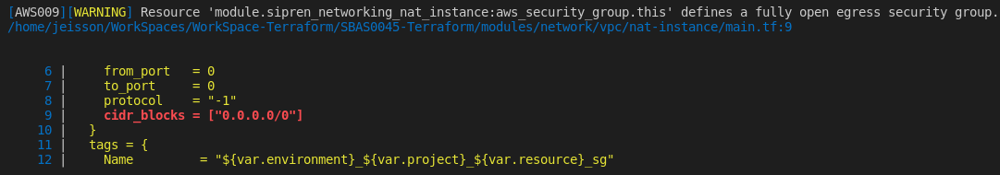

# Playground
Repositorio de Playground enfocado a consolidar y estructurar el conocimiento relacionado con la certificación de Terraform Associate.


## Content
- [Playground](#playground)
  - [Content](#content)
  - [Repository Topycs](#repository-topycs)
  - [Comandos Básicos de Terraform](#comandos-básicos-de-terraform)
    - [Iniciar plantilla o ejecución](#iniciar-plantilla-o-ejecución)
    - [Iniciar plan de ejecución](#iniciar-plan-de-ejecución)
    - [Aplicar el plan](#aplicar-el-plan)
    - [Eliminar los componentes creados con la plantilla](#eliminar-los-componentes-creados-con-la-plantilla)
    - [Validación y creación de workspace](#validación-y-creación-de-workspace)
    - [Saltar aprobación manual](#saltar-aprobación-manual)
    - [Aplicar formato al código fuente de Terraform](#aplicar-formato-al-código-fuente-de-terraform)
    - [Validar configuración de código](#validar-configuración-de-código)
  - [Validar Seguridad de Código](#validar-seguridad-de-código)
    - [Escaneo de código con **tfsec**](#escaneo-de-código-con-tfsec)
    - [Excepciones de validación con **tfsec**](#excepciones-de-validación-con-tfsec)
  - [Importar Infraestructura Existente](#importar-infraestructura-existente)


## Repository Topycs

- [Understand Terraform's purpose](https://www.notion.so/Understand-Terraform-s-purpose-27b0ebc9ac8e41f09cd7a7e90d6d3161)

- [Understand Terraform basics](https://www.notion.so/Understand-Terraform-basics-c2c3aefefe6d4b12b3d8c2e912493c6b)

- [Use the Terraform CLI ](https://www.notion.so/-Use-the-Terraform-CLI-1db9a6b3824c44f483d403ac32dd79b4)

- [Interact with Terraform modules](https://www.notion.so/Interact-with-Terraform-modules-75c1b1a2863e49549cb669d4ff865ba7)

- [Navigate Terraform workflow](https://www.notion.so/Navigate-Terraform-workflow-cc421202fd2b40fc9a52ab01325aba45)

- [Implement and maintain state](https://www.notion.so/Implement-and-maintain-state-de8f23ce640740658b460bf8c873000c)

- [Read, generate, and modify configuration](https://www.notion.so/Read-generate-and-modify-configuration-672bcba372a54f6dadbbf213d359780a)

- [Understand Terraform Cloud and Enterprise capabilities](https://www.notion.so/Understand-Terraform-Cloud-and-Enterprise-capabilities-aadc27f2d11742b98d46355ef242def4)


## Comandos Básicos de Terraform
### Iniciar plantilla o ejecución
>terraform init

### Iniciar plan de ejecución
> terraform plan

### Aplicar el plan
> terraform apply

### Eliminar los componentes creados con la plantilla
> terraform destroy

### Validación y creación de workspace
> terraform workspace
>
>  **Crear workspace de desarrollo - dev**:
>
> terraform workspace new dev

### Saltar aprobación manual
> terraform apply --auto-approve


> terraform destroy --auto-approve

### Aplicar formato al código fuente de Terraform
> terraform fmt -recursive

### Validar configuración de código
> terraform validate


## Validar Seguridad de Código


Para poder realizar la operación de validación de código se puede hacer uso de la herramienta tfsec la cual debe ser previamente instalada.

Para mas información de esta herramienta se puede validar **[tfsec](https://github.com/tfsec/tfsec )**

### Escaneo de código con **tfsec**
> **Ejemplo 1**: Escaneo recursivo:
>
> tfsec .
>
> **Ejemplo 2**
>
> tfsec ./source_project

### Excepciones de validación con **tfsec**

Para aquellos casos en los cuales en la validación de código estático se obtienen alertas sobre configuraciones que se requieren o se tienen contempladas en la solución, se debe proceder a configurar la excepción en el código fuente y realizar la documentación correspondiente a la excepción.

**Ejemplo:**

Error Generado </br>



Excepción configurada

```hcl
  egress {
    from_port   = 0
    to_port     = 0
    protocol    = "-1"
    #tfsec:ignore:AWS009
    cidr_blocks = ["0.0.0.0/0"]
  }
```


## Importar Infraestructura Existente

Desde terraform se puede realizar un import de la infraestructura que no fue creada desde el pipeline siguiendo estos pasos:

1. Definiendo el recurso que desea importar dentro de la plantilla

> resource "aws_instance" "priv-bastion" {}

2. Identificando el id del recurso que se desea importar

> ***id Instancia:***   i-00fc4527c169d2eaa

3. Ejecutando el comando de importación de terraform de la siguiente manera:

> terraform import {recurso definido en el paso 1} {id del recurso}
>
> terraform import aws_instance.priv-bastion i-00fc4527c169d2eaa

4. Finalmente con el comando terraform show podrá visualizar la configuración completa de la infraestructura

> **Ejemplo**
>
> terraform show -no-color > infra.txt

**Nota:** el comando anterior le permitirá ver la configuración con la que cuenta el recurso para que pueda utilizarla directamente en la plantilla. (esto requiere de modificación de la plantilla de acuerdo a los datos retornados).
